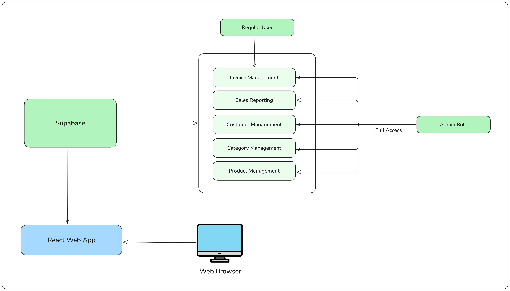

## Point of Sale System for Sarthi Bookshop

This Point of Sale (POS) system is designed specifically for Sarthi Bookshop to streamline sales processes and manage inventory efficiently.

[](https://supabase.com)



### Key Features

- **Create Invoice:** Generate new invoices for customer purchases.
- **View Invoices:** Manage existing invoices.
- **Create Items:** Add and manage items available for sale.
- **Customers:** Maintain customer information for personalized service.
- **Check Sales:** View sales data to analyze business performance. Currently supports monthly revenue tracking.

### Tech Stack

| Technology            | Framework/Library         |
| --------------------- | ------------------------- |
| Frontend              | React + Vite              |
| BaaS                  | Supabase (Databae , Auth) |
| Styling               | Tailwind CSS              |
| UI Component          | shadcn/ui                 |
| Production Deployment | Vercel                    |

### Run Project Locally

Clone the project

```bash
  git clone https://github.com/chamals3n4/sarathi-pos
```

Go to the project directory

```bash
  cd sarathi-pos
```

Install dependencies

```bash
  npm install
```

Start the server

```bash
  npm run dev
```

Once everything is set up, you can access the POS system through your local development server [ [localhost:5173](http://localhost:5173/) ]

###

© Copyright 2024 [@chamals3n4](https://www.github.com/chamals3n4)
